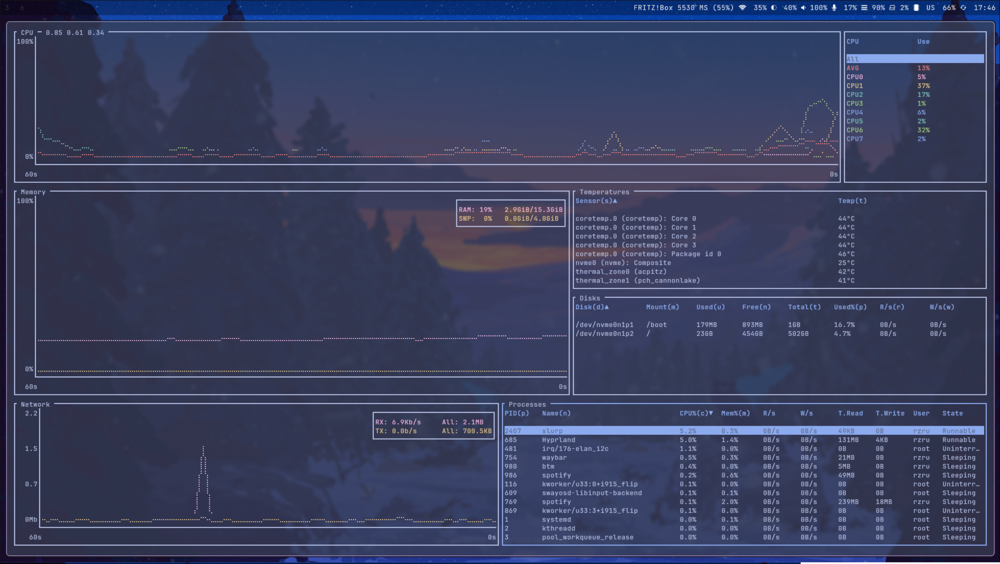

# rzru dotfiles

## Description

A collection of dotfiles for arch / hyprland combination that I use on my personal mashines. 

## Screenshots




## Dependencies

```
rofi, waybar, hyprland, hyprpaper, hyprlock, bottom, hypridle, brightnessctl, kitty, spotify-launcher, yay, neovim, astronvim, nushell, starship, rust, neofetch, bluetuith, chromium, pulseaudio, swayosd-server, telegram-desktop, ly, rust, python
```
